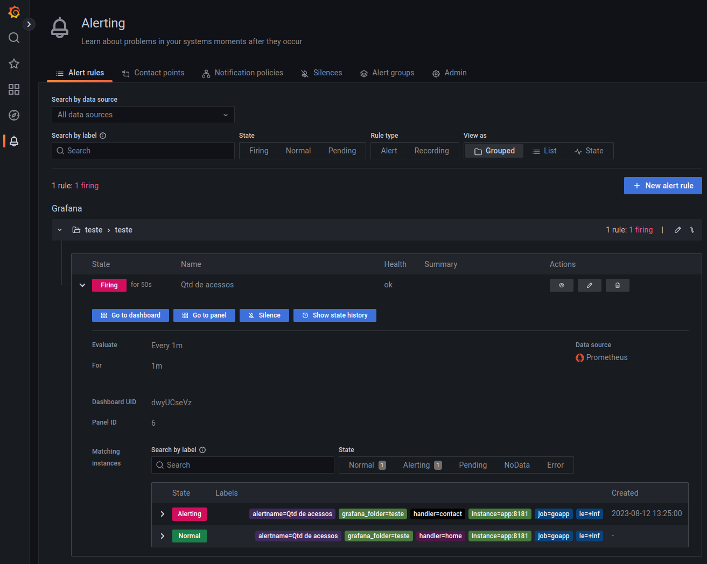

<h1 align="center">
  </img> Prometheus
</h1>

    </img>
    <a href="https://github.com/marcelobiao/poc-prometheus/blob/master/LICENSE.md">
        </img>
    </a>

  
  
  

## :gear: Tecnologias

Esse projeto foi desenvolvido com as seguintes tecnologias:

- [Prometheus](https://prometheus.io/)
- [cAdvisor](https://github.com/google/cadvisor)

## :computer: Sobre

Este projeto foi desenvolvido com o objetivo de aprimorar meus conhecimentos e adquirir experiência na utilização do Prometheus

## :memo: Licença

Esse projeto está sob a licença MIT. Veja o arquivo [LICENSE](LICENSE.md) para mais detalhes.

## :phone: Contato

Para dúvidas ou sugestões, as issues e pull requestes são sempre bem vindos, ou me envie uma mensagem pelo Discord (MarceloBiao#6673) para que possamos conversar :grin:.